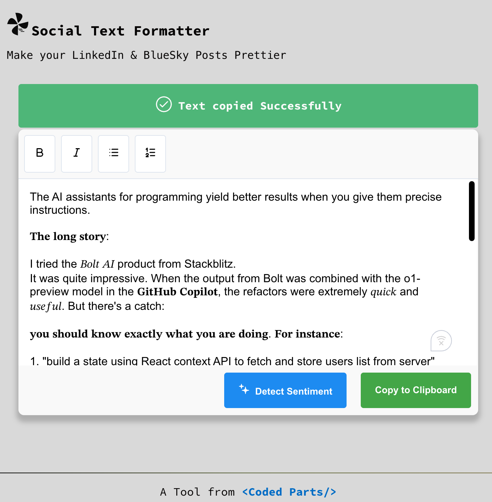

## Social Text Formatter

This is a simple text formatter that makes your social media posts look pretty by enabling bold and italics texts. It uses a `Unicode Substituion` technique to workaround the rendering limitations of such texts on social media platforms.

> [!TIP]
> The app also uses an EdgeAI (Gemini-nano on Chrome) for a feature that allows you to detect the overall perceived sentiment of your post content. To use this feature you'll need to enable the `experimental` gemini nano prompting flag in your Chrome browser settings.



## Quick Links

- [Steps to Run Locally](#steps-to-run-locally)
- [Steps to Enable Gemini-nano On-device Model on Chrome](#steps-to-enable-gemini-nano-on-device-model-on-chrome)
- [Standalone Usage](#standalone-usage)

### Steps to Run Locally

1. Clone the repository
2. Change into the repository's root directory
3. Run `npm install`
4. Run `npm run dev`

### Steps to Enable Gemini-nano On-device Model on Chrome

1. On your Chrome browser, navigate to `chrome://flags`
2. Search for `Prompt API for Gemini Nano`
   

3. Enable the flag and restart your browser

### Standalone Usage

Since the build exports a native webcomponent, you can use it in any HTML file by importing the script and using the tag `<social-text-formatter></social-text-formatter>`

1. Build the project by running `npm run build`
2. Copy the built js file to your project

```html
<!DOCTYPE html>
<html lang="en">
  <head>
    <script type="module" src="<path_to_the_built_js_file>.js"></script>
  </head>
  <body>
    <social-text-formatter />
  </body>
</html>
```
